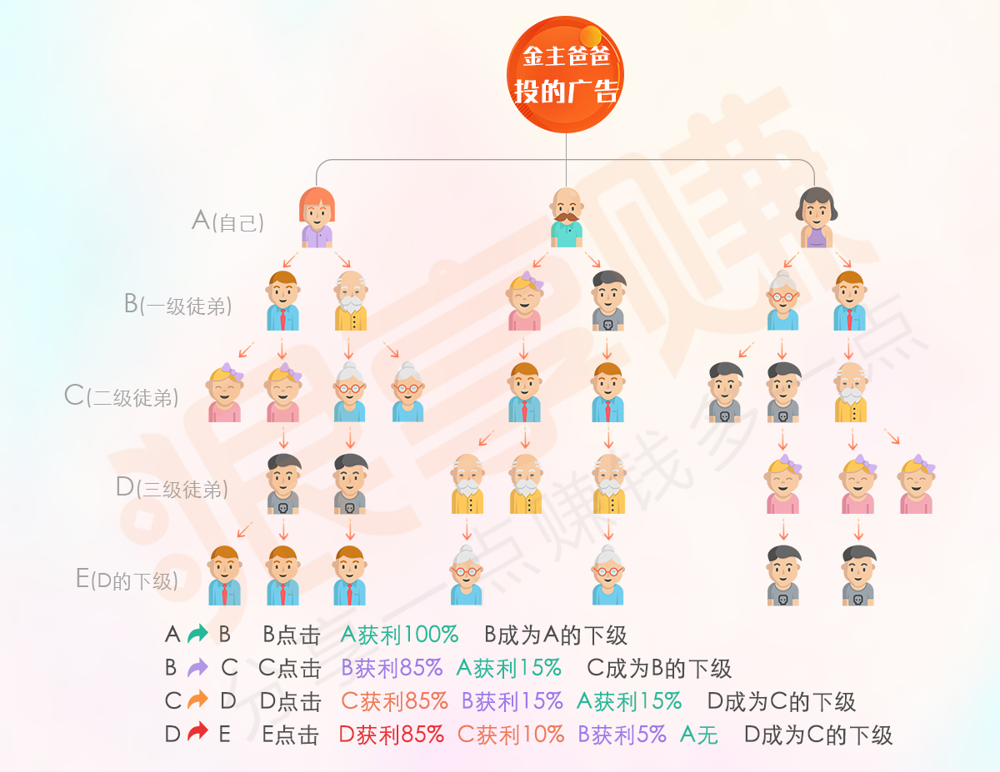

# TestClient

This project was generated with [Angular CLI](https://github.com/angular/angular-cli) version 1.2.7.

## Development server

Run `ng serve` for a dev server. Navigate to `http://localhost:4200/`. The app will automatically reload if you change any of the source files.

## Code scaffolding

Run `ng generate component component-name` to generate a new component. You can also use `ng generate directive|pipe|service|class|guard|interface|enum|module`.

## Build

Run `ng build` to build the project. The build artifacts will be stored in the `dist/` directory. Use the `-prod` flag for a production build.

## Running unit tests

Run `ng test` to execute the unit tests via [Karma](https://karma-runner.github.io).

## Running end-to-end tests

Run `ng e2e` to execute the end-to-end tests via [Protractor](http://www.protractortest.org/).
Before running the tests make sure you are serving the app via `ng serve`.

## Further help

To get more help on the Angular CLI use `ng help` or go check out the [Angular CLI README](https://github.com/angular/angular-cli/blob/master/README.md).
"# client2.0" 


# 简介
以往的两期
* [一期](./old.md)
* [二期](./two.md)



微信端
;

广告商平台: [http://wq8.youqulexiang.com/login](http://wq8.youqulexiang.com/login) 

系统管理平台  [http://wq8.youqulexiang.com/admin/login](http://wq8.youqulexiang.com/admin/login)

> 初来宝地,构建三级分销微信推广系统已一月有余,构建了三个平台,现已上线。微信的公众平台主要负责用户端,广告投放,分享广告,三级收徒,立即提现。图文分享。链接推广,收徒二维码,视频分享传播,设置广告关注公众号,一应俱全。

产品的从无到有的建立过程,我们完全使用世界上最流行的前端三大框架开发之一的angular开发,让我们的应用性能更加快速,配合页面切换的动画(如虎添翼)负载更低。后台使用nodejs+Koa+mongoose高并发应用程序。在同类产品中,我们应用的性能是最快的,超过其他的产品,可以进入应用体验,页面切换无刷新,。

而我们一个月使产品从无到上线,在人数不占优势的情况下已经是非常高效率,在人数如此少的情况下构建出了一个系统还是分三个平台。
微信端的复杂性是在于三级分销,如何计算师徒关系链,和返利制度。图文分享,并且原有的广告商是放在了微信端,后来分裂出来了广告商平台。微信端主要由我在负责。
广告商平台,负责发布广告,类似的图文报表。


# 问题的复杂性
问:现在网站建设如此之多,而网站建设的价格越来越低。似乎开发这样一个系统无需这么长时间?

答:大部分网站都是cms套站的工具,甚至无需编写后台,无需构建数据库,类似php的dedecms甚至只需要写几个标签就可以套出一套官网。后台自动生成。类似首页列表页代码如下 
```html
<article-list>
<article > <a>  文章标题 </a></article>
</article-list>
```
类似于cms的已经完全解放了开发者的工作,开发建站这样的工作快捷简单,然而对于一个复杂的应用,可扩展的应用,这样的东西是无法使用cms来构建的,例如三级分销,分享赚钱,立即提现,视频传播等等。而广告商的图文报表,管理后台的师徒关系树等等。从未听说过前程无忧是cms套站做出来的。而我们平台是从零开始搭建,数据库从零开始设计,所以功能都可以拓展,现在想来一个月是从无到有的过程。


问:我们能带来什么?

答:在往网络推广的方向走,我们自主开发的推广系统会在下个版本,下下个版本往多平台,可定制化投放群体,付费方式等方向走的更精尖。我们仅仅在一个月内,功能,模式,应用的性能都已经超越了同类产品的享客威盟。在后面的版本会逐渐赶超其他同类产品。最终的目标是行业的领军人物。能够比红人点点做的更大更好就是我们的目标。


# 二期的开发方向
* 广告定向, 地理位置,性别,时间, 追踪用户的阅读分享习惯
* 制作app汇集各个平台的推手
* 多平台式传播,往QQ,QQ空间,微博,新闻媒体等传播方向扩展方向
* 继续完善多种不同的传播方式,付费方式,广告商平台的投放方式


# 当前的问题
一： 每个行业都有其专业的知识壁垒,而我们所做的事情复杂度是外行人所不了解的,我希望能够担负起领导开发团队继续往后面的路走。所谓用人不疑,疑人不用。很多时候外行人对我们所做的事情并不了解,会徒增我们的工作的复杂度,也给予不了我们需要的支持。

二: 我希望人手上有所补充。目前我们的应用平台开发者分为三个人,我主要负责微信端的开发维护,刘晴霞负责广告商的维护。张超负责系统管理后台。马上我们要做app。就目前而言,我们最少需要一个测试人员,负责帮助查找问题,复现问题。测试这件事,不仅仅是报告问题,在之前的工作中,有时候提出一个ios分享没有图文,却没有明确指出哪一款ios手机出现问题，也没有将出问题的ios拿到手上进行测试,根本无从下手解决问题。


# 总结

在一期的开发工作中，产品是从无到有。从对一个东西不了解,到了解,到实现。这之间做出了许多努力,解决了许多问题。面对需求,从未拒绝,完成了所有的需求,在后面的工作同样抱着这种态度,迎难而上。
1. 需要自定义部门的工作计划安排，我希望能担任项目经理的职位,带领开发团队继续做出许多贡献。不方便让吴主管为开发部门承担责任。
2. 需要测试人员至少一名,帮助我们分散管理开发问题,使我们可以专注完成自己的事情。


# 下一期 工作计划


|时间|事情|人物|
|---|---|---|
|8-30 ** 9-2|清理微信端的遗留问题,迁移微信公众号,IOS二维码,应用加快加载速度|杨杰|
|8-30 ** 9-2|清理微信端的遗留问题,IOS二维码修复问题,一些例如提现,完善信息友好的提示|杨杰|
|8-30 ** 9-2|部分IOS的分享图文问题,提现记录,部分广告不从顶部加载|杨杰|
|8-30 ** 9-2|应用界面升级+新增收徒学堂等功能|刘晴霞|
|8-30 ** 9-2|系统广告管理,广告商管理|张超|
|8-30 ** 9-2|Banner管理,管理界面部分数据出现多位小数,部分性别显示 日期显示,帮助|张超|
|8-30 ** 9-2|系统广告管理,广告商管理|张超|
|---|---|---|
|9-4 ** 9-23|开发移动应用App | 杨杰,刘晴霞|
|9-4 ** 9-23|维护改进现有的微信端,广告商端,系统管理,Banner广告竞价等功能的开发|张超|
|---|---|---|
|9-25** 以后|QQ，微博,QQ空间等其他平台的推广业务|待定|

